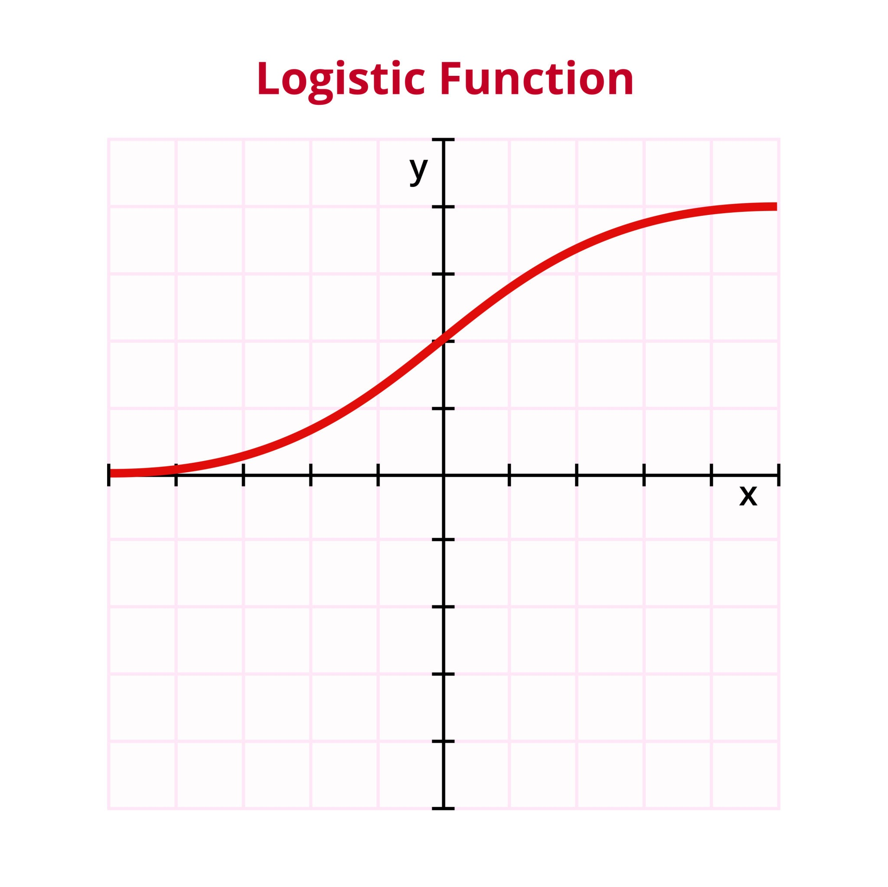

# 시그모이드(Sigmoid) 함수와 이진 분류 이해

#### 이 프로젝트는 인공지능 모델에서 입력값을 확률(0과 1 사이의 값)로 변환해주는 시그모이드 함수의 원리를 학습합니다.

### 목차
### 1. 시그모이드 함수란?
### 2. 수학적 기초: 자연상수 e
### 3. 시그모이드 함수의 구현 및 계산
### 4. 이진 분류에서의 활용

#### 1. 시그모이드 함수란?
시그모이드 함수는 인공지능, 특히 이진 분류(Binary Classification) 문제에서 매우 중요한 함수입니다.수식: sigmoid(H(x)) = 1 / (1 + e^(-H(x)))특징: 어떤 입력값이 들어오더라도 출력값을 항상 0과 1 사이의 실수로 제한합니다. 이를 통해 모델의 출력을 '확률'로 해석할 수 있게 합니다.

#### 2. 수학적 기초: 
자연상수 e시그모이드 함수의 계산을 위해 파이썬의 math 라이브러리를 사용하여 자연상수 e (약 2.71828)를 다루는 방법을 학습합니다.거듭제곱: en 연산자를 활용하여 수학적 수식을 코드화합니다.역수 계산: e-1 등을 통해 시그모이드 함수 내의 분모를 구성하는 핵심 계산법을 익힙니다.

#### 3. 시그모이드 함수의 구현 및 계산
실제 파이썬 코드를 통해 특정 입력값에 대해 시그모이드 함수가 어떻게 0~1 사이의 확률값으로 변환하는지 단계별로 확인합니다.입력값 H(x)의 크기에 따른 출력값의 변화를 확인하며 함수가 어떻게 동작하는지 이해합니다.

#### 4. 이진 분류에서의 활용
이 학습의 궁극적인 목적은 이진 분류입니다.모델의 출력값을 시그모이드 함수에 통과시켜 최종적으로 0 혹은 1로 분류하는 로직을 이해합니다.예: "스팸인가 아닌가?", "합격인가 불합격인가?"와 같은 질문에 답하기 위해 사용됩니다.

